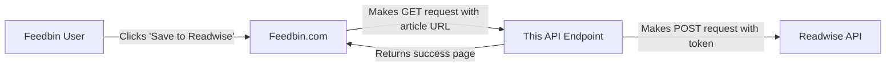

# Feedbin to Readwise API

This is an API endpoint (specifically a serverless function) that acts as a bridge between Feedbin and Readwise. It's essentially a "save to Readwise" service that allows Feedbin users to send articles they're reading directly to their Readwise account.

## Flow:

## Key components:
1. **Serverless Function**: This code is deployed as a serverless function (Vercel, Netlify, or similar) that runs on-demand
2. **Request Handler**: Takes GET requests from Feedbin with query parameters:
   - `url`: The article to save
   - `title`: Article title (optional)
   - `source`: Where it's from (defaults to "Feedbin")
3. **API Relay**: Uses the Readwise API token (stored in environment variables) to forward the article to Readwise
4. **User Feedback**: Returns a success message as auto-closing HTML page instead of raw JSON

It's a good example of an "API-to-API bridge" or "API adapter" pattern, where you're:
- Transforming between different HTTP methods (GET → POST)
- Adding authentication (the Readwise token)
- Transforming the response (from JSON to a user-friendly HTML page)
- Adding security headers and error handling

This kind of integration is common when you want to connect two services that don't have direct integration, especially when one service (Feedbin) needs to trigger actions in another (Readwise) without exposing sensitive credentials (the Readwise API token) to the client side.
